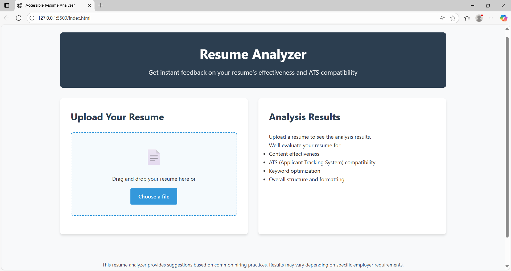

#  Resume Analyzer

**Try it live:** [Resume Analyzer on GitHub Pages](https://NavyaSree078.github.io/ResumeAnalyzerApp/)

---

##  Application Overview
The **Resume Analyzer** is a browser-based tool that provides instant, AI-powered feedback on resumes. After pasting or uploading your resume, it highlights key areas—such as skills, experiences, formatting, and keyword usage—and gives you a concise match score with helpful improvement suggestions. No installation needed: just open the app in your browser and start improving your resume.

---

##  Screenshots

### Home / Upload Interface
<p align="center">
  
  
</p>

---

##  Tech Stack
- **Frontend only** — pure HTML, CSS, and React (via CDN + Babel)
- Lightweight and fast, runs directly in the browser
- No backend, no API keys, and no dependencies to install—just open the page and go

---

##  How to Use Locally
1. Clone or download the repo:
   ```bash
   git clone https://github.com/NavyaSree078/ResumeAnalyzerApp.git


